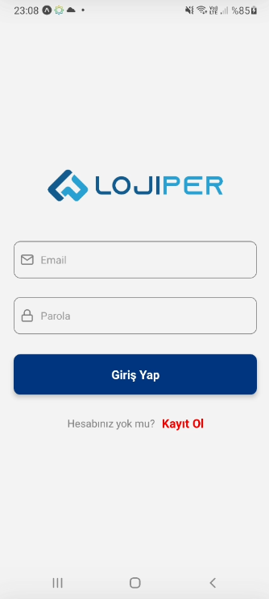

# LojiperMobile

## Installation

1. Clone the repository:

   ```shell
   git clone https://github.com/altnskmuhammed/LojiperMobile.git

   ```

2. Navigate to the project directory:

   ```shell
   cd LojiperMobile

   ```

3. Navigate to the project directory:

   ```shell
   npm install

   ```

4. Start the development server:

   ```shell
   npm start
   ```


