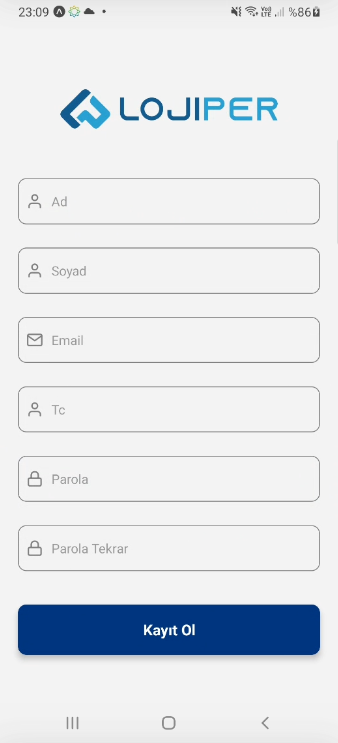
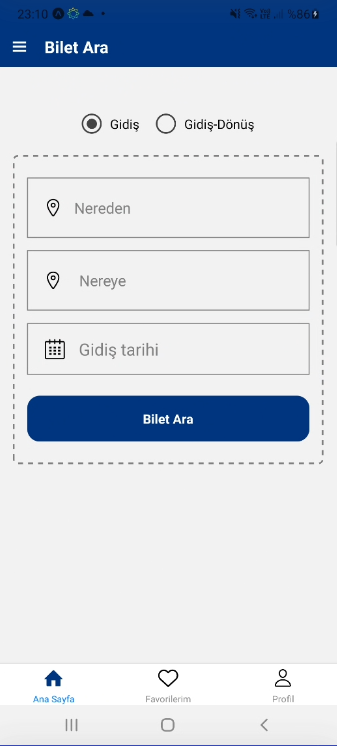
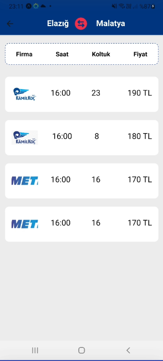
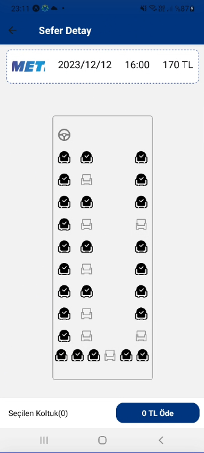
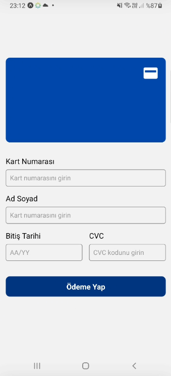
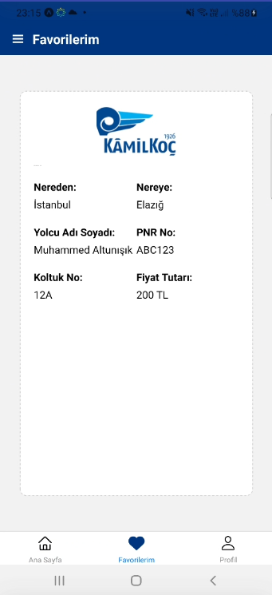
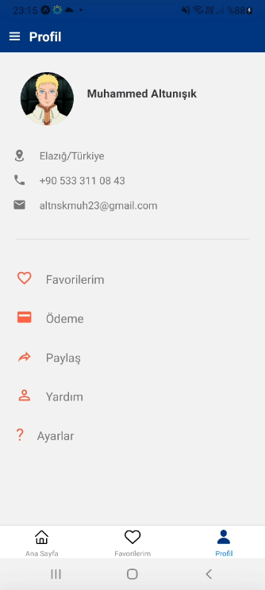

# LojiperMobile

## Installation

1. Clone the repository:

   ```shell
   git clone https://github.com/altnskmuhammed/LojiperMobile.git

   ```

2. Navigate to the project directory:

   ```shell
   cd LojiperMobile

   ```

3. Navigate to the project directory:

   ```shell
   npm install

   ```

4. Start the development server:

   ```shell
   npm start
   ```

### Login Page


### Register Page



### Home Page

U need to choice Elazığ => Malatya because for now we only have some data :)
u can choice any date for now u wıll find result we not control date



### Ticket List



### Ticket Detail



### Payment Page



### Favorite List



### Profile Page


